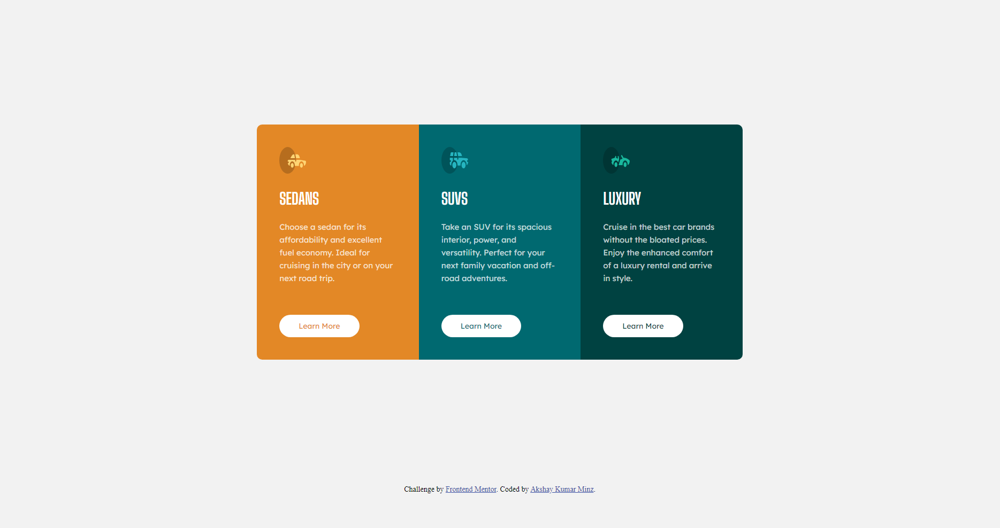
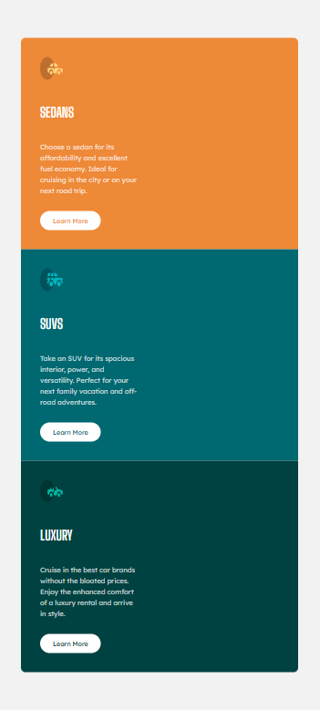

# Frontend Mentor - 3-column preview card component solution

This is a solution to the [3-column preview card component challenge on Frontend Mentor](https://www.frontendmentor.io/challenges/3column-preview-card-component-pH92eAR2-). Frontend Mentor challenges help you improve your coding skills by building realistic projects.

## Table of contents

- [Frontend Mentor - 3-column preview card component solution](#frontend-mentor---3-column-preview-card-component-solution)
  - [Table of contents](#table-of-contents)
  - [Overview](#overview)
    - [The challenge](#the-challenge)
    - [Screenshot](#screenshot)
    - [Links](#links)
    - [Built with](#built-with)
    - [What I learned](#what-i-learned)
    - [Useful resources](#useful-resources)
  - [Author](#author)

## Overview

### The challenge

Users should be able to:

- View the optimal layout depending on their device's screen size
- See hover states for interactive elements

### Screenshot

### Links

- Solution URL: [Solution](https://akshayv30.github.io/Front-End-Mentor-Challenges/3-column-preview-card-component-main/)
- Live Site URL: [Live site](https://akshayv30.github.io/Front-End-Mentor-Challenges/3-column-preview-card-component-main/index.html)

### Built with

- Semantic HTML5 markup
- CSS custom properties
- Flexbox
- Mobile-first workflow

### What I learned

I learned to work with css feature especially with psuedo class, to add few hover effect as well as using cursor as a pointer.

### Useful resources

---

## Author

- Website - [Akshay Minz](https://akshayv30.github.io/3-column-preview-card-component-main/)
- Frontend Mentor - [@AkshayV30](https://www.frontendmentor.io/profile/AkshayV30)

--
