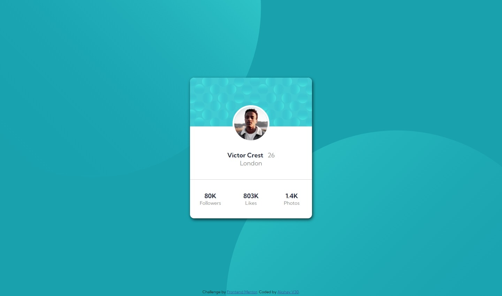
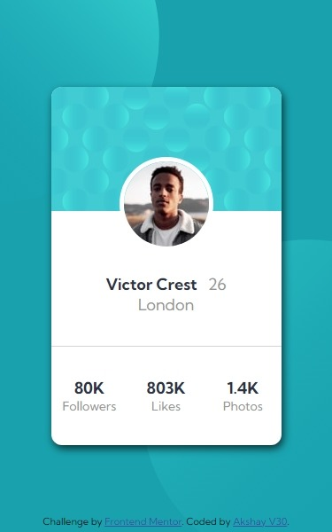

# Frontend Mentor - Profile card component solution

This is a solution to the [Profile card component challenge on Frontend Mentor](https://www.frontendmentor.io/challenges/profile-card-component-cfArpWshJ). Frontend Mentor challenges help you improve your coding skills by building realistic projects.

## Table of contents

- [Frontend Mentor - Profile card component solution](#frontend-mentor---profile-card-component-solution)
  - [Table of contents](#table-of-contents)
  - [Overview](#overview)
    - [The challenge](#the-challenge)
    - [Screenshot](#screenshot)
    - [Links](#links)
  - [My process](#my-process)
    - [Built with](#built-with)
    - [What I learned](#what-i-learned)
    - [Continued development](#continued-development)
    - [Useful resources](#useful-resources)
  - [Author](#author)
  - [Acknowledgments](#acknowledgments)

**Note: Delete this note and update the table of contents based on what sections you keep.**

## Overview

### The challenge

- Build out the project to the designs provided

### Screenshot




### Links

- Solution URL: [Solution URL](https://akshayv30.github.io/Front-End-Mentor-Challenges/profile-card-component-main)
- Live Site URL: [Live Site](https://akshayv30.github.io/Front-End-Mentor-Challenges/profile-card-component-main/index.html)

## My process

### Built with

- Semantic HTML5 markup
- CSS custom properties
- Flexbox
- CSS Grid
- Desktop-first workflow

### What I learned

```css
background: hsl(185, 75%, 39%);

background-image: url(./images/bg-pattern-top.svg),
  url(./images/bg-pattern-bottom.svg);

background-repeat: no-repeat no-repeat;

background-position: right 48vw bottom 40vh, left 45vw top 44vh;
```

### Continued development

---

### Useful resources

---

## Author

- Website - [Akshay V30](https://github.com/AkshayV30)
- Frontend Mentor - [@AkshayV30](https://www.frontendmentor.io/profile/AkshayV30)

## Acknowledgments

---
