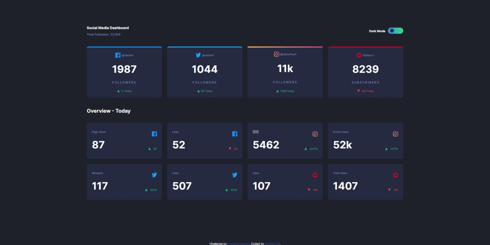
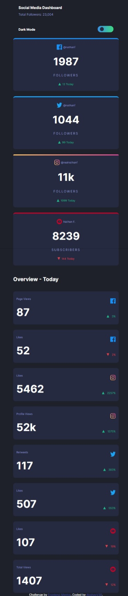
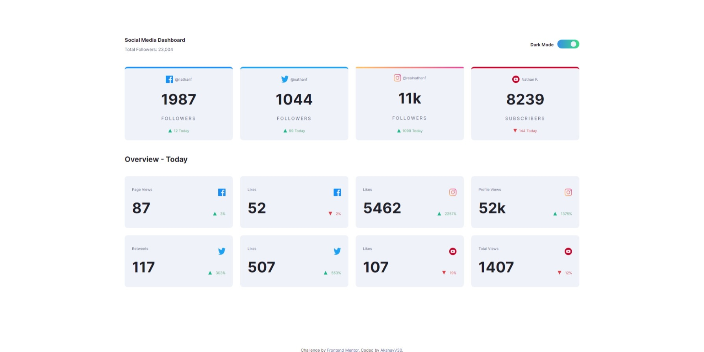

# Frontend Mentor - Social media dashboard with theme switcher solution

This is a solution to the [Social media dashboard with theme switcher challenge on Frontend Mentor](https://www.frontendmentor.io/challenges/social-media-dashboard-with-theme-switcher-6oY8ozp_H). Frontend Mentor challenges help you improve your coding skills by building realistic projects.

## Table of contents

- [Frontend Mentor - Social media dashboard with theme switcher solution](#frontend-mentor---social-media-dashboard-with-theme-switcher-solution)
  - [Table of contents](#table-of-contents)
  - [Overview](#overview)
    - [The challenge](#the-challenge)
    - [Screenshot](#screenshot)
    - [Links](#links)
  - [My process](#my-process)
    - [Built with](#built-with)
    - [What I learned](#what-i-learned)
    - [Continued development](#continued-development)
    - [Useful resources](#useful-resources)
  - [Author](#author)
  - [Acknowledgments](#acknowledgments)

**Note: Delete this note and update the table of contents based on what sections you keep.**

## Overview

### The challenge

Users should be able to:

- View the optimal layout for the site depending on their device's screen size
- See hover states for all interactive elements on the page
- Toggle color theme to their preference

### Screenshot






### Links

- Solution URL: [Solution URL](https://github.com/AkshayV30/Front-End-Mentor-Challenges/tree/master/social-media-dashboard-with-theme-switcher-master)
- Live Site URL: [live site URL ](https://akshayv30.github.io/Front-End-Mentor-Challenges/social-media-dashboard-with-theme-switcher-master/index.html)

## My process

### Built with

- Semantic HTML5 markup
- CSS custom properties
- CSS Grid
- Flexbox
- Desktop-first workflow

### What I learned

```js
//asyncronous way
document.addEventListener("DOMContentLoaded", () => {
  const themeSelector = document.getElementById("rng");
  const body = document.body;
  // console.log(body, themeSelector);

  themeSelector.addEventListener("change", (e) => {
    const selectedValue = parseInt(e.target.value);
    // console.log(selectedValue);

    const themes = ["darken", "lighten"];
    body.classList.remove(...themes);
    body.classList.add(themes[selectedValue]);
  });
});
```

### Continued development

### Useful resources

## Author

- Frontend Mentor - [@AkshayV30](https://www.frontendmentor.io/profile/AkshayV30)

--

## Acknowledgments
