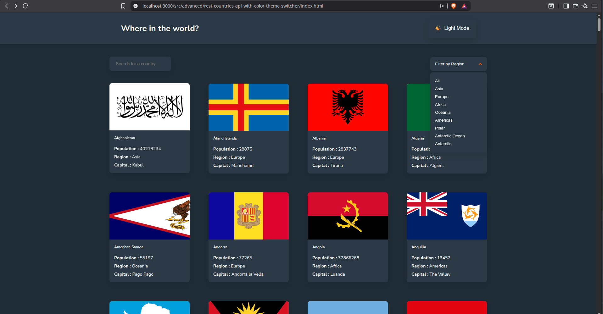
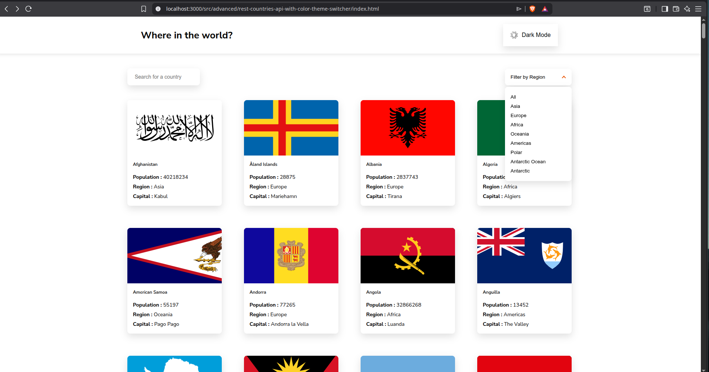

# Frontend Mentor - REST Countries API with color theme switcher solution

This is a solution to the [REST Countries API with color theme switcher challenge on Frontend Mentor](https://www.frontendmentor.io/challenges/rest-countries-api-with-color-theme-switcher-5cacc469fec04111f7b848ca). Frontend Mentor challenges help you improve your coding skills by building realistic projects.

## Table of contents

- [Frontend Mentor - REST Countries API with color theme switcher solution](#frontend-mentor---rest-countries-api-with-color-theme-switcher-solution)
  - [Table of contents](#table-of-contents)
  - [Overview](#overview)
    - [The challenge](#the-challenge)
    - [Screenshot](#screenshot)
    - [Links](#links)
  - [My process](#my-process)
    - [🚀 Features](#-features)
  - [🧱 Architecture Highlights](#-architecture-highlights)
  - [🛠️ Built With](#️-built-with)
    - [What I learned](#what-i-learned)
  - [🧠 Key Learnings](#-key-learnings)
    - [1. Component System in Vanilla JS](#1-component-system-in-vanilla-js)
    - [2. State Management Pattern](#2-state-management-pattern)
  - [Centralized state:](#centralized-state)
    - [3. Custom Routing (SPA Behavior)](#3-custom-routing-spa-behavior)
    - [4. Performance Optimization](#4-performance-optimization)
    - [5. Responsive System](#5-responsive-system)
    - [Continued development](#continued-development)
  - [Planned improvements:](#planned-improvements)
    - [Useful resources](#useful-resources)
  - [Author](#author)
  - [Acknowledgments](#acknowledgments)

## Overview

### The challenge

Users should be able to:

- See all countries from the API on the homepage
- Search for a country using an `input` field
- Filter countries by region
- Click on a country to see more detailed information on a separate page
- Click through to the border countries on the detail page
- Toggle the color scheme between light and dark mode _(optional)_

### Screenshot




### Links

- Solution URL: [Solution](https://github.com/AkshayV30/Front-End-Mentor-Challenges/tree/master/src/advanced/rest-countries-api-with-color-theme-switcher)

- Live Site URL: [Lve site URL](https://akshayv30.github.io/Front-End-Mentor-Challenges/src/advanced/rest-countries-api-with-color-theme-switcher/index.html)

## My process

### 🚀 Features

Users can:

- 🌐 View all countries
- 🔍 Search countries by name (debounced input)
- 🌎 Filter by region (custom dropdown)
- 📄 View detailed country information
- 🔙 Navigate back from details page
- 🎯 Client-side routing using hash-based navigation
- 🌗 Toggle between light and dark themes
- 📱 Fully responsive (desktop → tablet → mobile)

---

## 🧱 Architecture Highlights

This project is built with a **modular, framework-like architecture using Vanilla JS**:

- Component-based structure
- Centralized state management (`appState`)
- Custom renderer + router
- Separation of concerns:
  - `features/` → business logic
  - `components/` → UI blocks
  - `core/` → rendering & state
  - `shared/` → utilities & styles

---

## 🛠️ Built With

- Semantic HTML5
- CSS Custom Properties (Design Tokens)
- Flexbox + CSS Grid
- Vanilla JavaScript (ES Modules)
- Custom Component System
- Hash-based Routing
- Debounced Input Handling
- Responsive Design (Desktop-first)

### What I learned

---

## 🧠 Key Learnings

### 1. Component System in Vanilla JS

Built reusable UI blocks without React:

```js
const Component = () => {
  return {
    render: () => `...`,
    bind: (root) => { ... }
  }
}
```

### 2. State Management Pattern

## Centralized state:

```js
export const appState = {
  countries: [],
  filtered: [],
  filters: {
    search: "",
    region: "All",
  },
};
```

### 3. Custom Routing (SPA Behavior)

```js
window.addEventListener("hashchange", handleRoute);
```

### 4. Performance Optimization

- Debounced search input
  - Minimal DOM re-renders
  - Event delegation
    -GPU-friendly CSS animations

### 5. Responsive System

- Desktop-first approach
- Grid auto-adaptation
- Flexible layout containers

### Continued development

## Planned improvements:

- Add pagination / infinite scroll
- Add API integration (instead of static JSON)
- Improve accessibility (ARIA, keyboard nav)
- Add unit testing (Jest / Vitest)
- Convert into React / Next.js version for comparison
- Add loading skeletons & error states

### Useful resources

- MDN Web Docs (CSS Grid, Flexbox, DOM APIs)
- JavaScript.info (Event delegation, architecture patterns)

## Author

- Website - [AkshayV30](https://www.your-site.com)
- Frontend Mentor - [@AkshayV30](https://www.frontendmentor.io/profile/yourusername)

## Acknowledgments

- Frontend Mentor for the challenge
- Inspiration from modern frontend architectures (React-like patterns in Vanilla JS)
