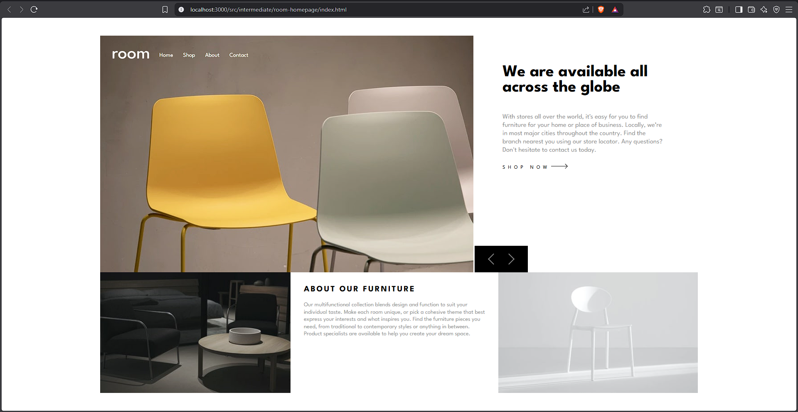
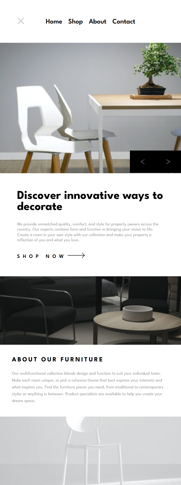

# Frontend Mentor - Room homepage solution

This is a solution to the [Room homepage challenge on Frontend Mentor](https://www.frontendmentor.io/challenges/room-homepage-BtdBY_ENq). Frontend Mentor challenges help you improve your coding skills by building realistic projects.

## Table of contents

- [Frontend Mentor - Room homepage solution](#frontend-mentor---room-homepage-solution)
  - [Table of contents](#table-of-contents)
  - [Overview](#overview)
    - [The challenge](#the-challenge)
    - [Screenshot](#screenshot)
    - [Links](#links)
  - [My process](#my-process)
    - [Built with](#built-with)
- [](#)
    - [Key Features \& Learnings](#key-features--learnings)
    - [Performance Considerations](#performance-considerations)
    - [Continued Development](#continued-development)
    - [Useful Resources](#useful-resources)
    - [Author](#author)
    - [Acknowledgments](#acknowledgments)

## Overview

### The challenge

Users should be able to:

- View the optimal layout for the site depending on their device's screen size
- See hover states for all interactive elements on the page
- Navigate the slider using either their mouse/trackpad or keyboard

### Screenshot





### Links

- Solution URL: [Solution URL here](https://akshayv30.github.io/Front-End-Mentor-Challenges/src/intermediate/room-homepage/index.html)
- Live Site URL: [Live-Site](https://github.com/AkshayV30/Front-End-Mentor-Challenges/tree/master/src/intermediate/room-homepage)

## My process

### Built with

- Semantic HTML5 markup
- Modern CSS (Flexbox + Grid)
- Responisve Design (desktop-first-approach)
- Vanilla Javascript (modular architecture)
- ES Modules
- Custom Slider Logic (no Libraries)

#

### Key Features & Learnings

1. Modular JavaScript Architecture
   - Separated UI components (Navbar, Slider)
   - Clean init() and destroy() lifecycle pattern
   - Reusable and scalable structure

   ```js
   export function createSlider(container) {
     return {
       init,
       destroy,
     };
   }
   ```

2. Custom Infinite Slider (No Libraries)
   - Implemented looping logic using cloned slides
   - Smooth transitions using translate3d
   - Prevented layout shifts and flickering

   ```js
   track.style.transform = `translate3d(-${index * 100}%, 0, 0)`;
   ```

3. Touch + Momentum Swipe Support
   - Swipe detection using touch events
   - Velocity-based slide switching
   - Mobile-first interaction improvements

4. Responsive Images (Performance Optimization)
   - Used <picture> for adaptive loading
   - Avoided background-image for better control and SEO

     ```html
     <picture>
       <source media="(max-width:768px)" srcset="mobile.jpg" />
       
     </picture>
     ```

5. Mobile Navigation System
   - JS-controlled toggle state
   - Smooth slide-down animation
   - Overlay-style full-screen navigation

### Performance Considerations

- Lazy loading images (loading="lazy")
- Avoided unnecessary reflows
- Used GPU-accelerated transforms (translate3d)
- Minimal DOM re-renders

### Continued Development

Planned improvements:

- Add autoplay + pause on hover
- Improve accessibility (ARIA roles, focus trapping)
- Add gesture inertia refinement
- Convert to framework version (React / Next.js) for scalability
- Introduce animation library (GSAP / Framer Motion equivalent)

### Useful Resources

- MDN Web Docs — Core reference for JS, CSS, and DOM
- Frontend Mentor Community — Inspiration and alternative approaches
- CSS Tricks — For layout and animation patterns

### Author

Frontend Mentor: @AkshayV30

### Acknowledgments

Frontend Mentor for the challenge design. Community solutions that helped refine slider logic and responsiveness approach
