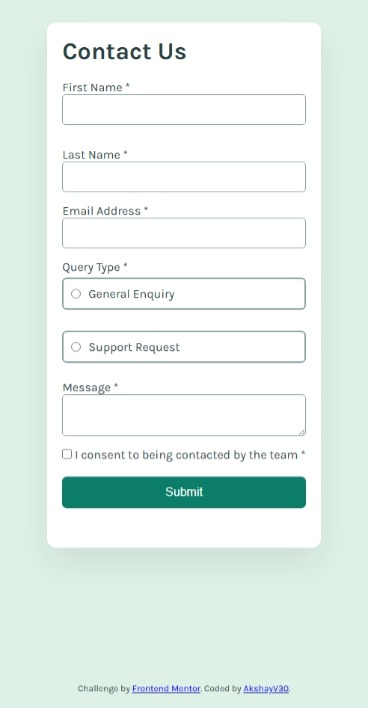
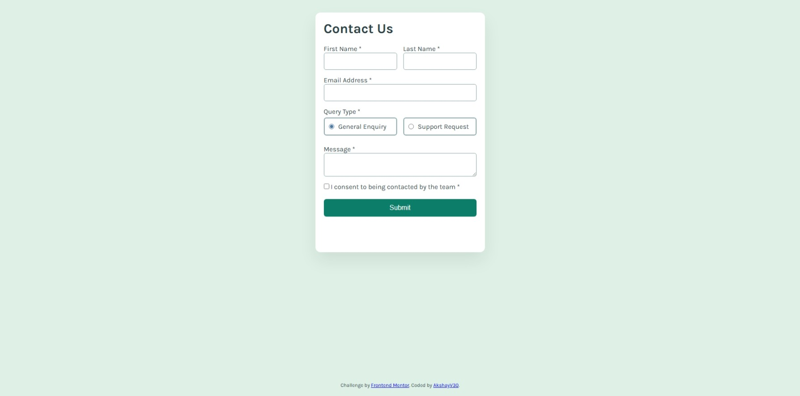

# Frontend Mentor - Contact form solution

This is a solution to the [Contact form challenge on Frontend Mentor](https://www.frontendmentor.io/challenges/contact-form--G-hYlqKJj). Frontend Mentor challenges help you improve your coding skills by building realistic projects.

This implementation focuses on accessibility, validation architecture, clean layout engineering, and responsive design using semantic HTML, modern CSS, and vanilla JavaScript.

---

## Table of contents

- [Frontend Mentor - Contact form solution](#frontend-mentor---contact-form-solution)
  - [Table of contents](#table-of-contents)
  - [Overview](#overview)
    - [The challenge](#the-challenge)
    - [Screenshot](#screenshot)
    - [Links](#links)
  - [My process](#my-process)
    - [Built with](#built-with)
    - [What I learned](#what-i-learned)
      - [1. Accessible Form Structure](#1-accessible-form-structure)
      - [2. Configuration-Based Validation Logic](#2-configuration-based-validation-logic)
      - [3. Toast Notification with Controlled State](#3-toast-notification-with-controlled-state)
      - [4. UX Micro-Details](#4-ux-micro-details)
  - [Continued development](#continued-development)
  - [Useful resources](#useful-resources)
  - [Author](#author)
  - [Acknowledgments](#acknowledgments)

---

## Overview

### The challenge

Users should be able to:

- Complete the form and see a success toast message upon successful submission
- Receive form validation messages if:
  - A required field has been missed
  - The email address is not formatted correctly

- Complete the form only using their keyboard
- Have inputs, error messages, and the success message announced on their screen reader
- View the optimal layout for the interface depending on their device's screen size
- See hover and focus states for all interactive elements on the page

---

### Screenshot




---

### Links

- [Solution URL](https://github.com/AkshayV30/Front-End-Mentor-Challenges/tree/master/src/junior/contact-form)
- [Live Site URL](https://akshayv30.github.io/Front-End-Mentor-Challenges/src/junior/contact-form/index.html)

---

## My process

### Built with

- Semantic HTML5 markup
- CSS custom properties
- Flexbox
- CSS Grid
- Mobile-first workflow
- Vanilla JavaScript (ES6)
- Accessibility best practices (ARIA, keyboard navigation)

No external libraries or frameworks were used.

---

### What I learned

#### 1. Accessible Form Structure

Using proper semantic grouping improves usability and screen reader compatibility:

```html
<fieldset>
  <legend>Query Type *</legend>
</fieldset>
```

This ensures radio inputs are logically grouped and announced correctly.

---

#### 2. Configuration-Based Validation Logic

Instead of hardcoding validation repeatedly, I used a structured configuration:

```js
const fields = [
  { id: "firstName", message: "First name is required" },
  { id: "lastName", message: "Last name is required" },
  {
    id: "email",
    message: "Please enter a valid email",
    pattern: /^\S+@\S+\.\S+$/,
  },
  { id: "message", message: "Message is required" },
];
```

This approach:

- Reduces duplication
- Improves maintainability
- Makes extending validation rules straightforward

---

#### 3. Toast Notification with Controlled State

The success message is handled via class toggling:

```js
toast.classList.add("show");
```

With CSS-driven animation using `transform` and `opacity`, avoiding external libraries.

---

#### 4. UX Micro-Details

- Cursor behavior adjusted:
  - Text inputs → `cursor: text`
  - Radio/checkbox/button → `cursor: pointer`

- Clear visual focus states
- Responsive stacking below 600px
- Outside-click dismissal for toast

These small improvements significantly enhance perceived quality.

---

## Continued development

In future iterations, I would like to:

- Add real-time validation with debouncing
- Integrate backend submission (API endpoint)
- Improve accessibility with automated testing tools (e.g., axe)
- Convert to TypeScript for stronger type safety
- Abstract validation logic into reusable modules

---

## Useful resources

- MDN Web Docs – Form validation patterns
- MDN Web Docs – ARIA live regions
- CSS-Tricks – Sticky footer patterns

These resources helped reinforce accessibility and layout best practices.

---

## Author

- Frontend Mentor - [@AkshayV30](https://www.frontendmentor.io/profile/AkshayV30)

---

## Acknowledgments

Challenge by **Frontend Mentor**.

Completed independently as part of structured front-end skill development.
