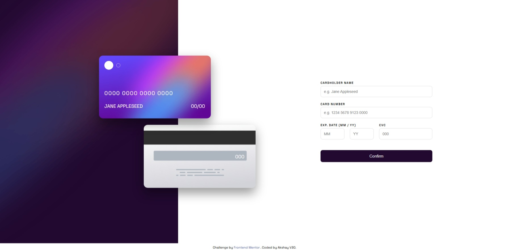

# Frontend Mentor - Interactive card details form solution

This is a solution to the [Interactive card details form challenge on Frontend Mentor](https://www.frontendmentor.io/challenges/interactive-card-details-form-XpS8cKZDWw). Frontend Mentor challenges help you improve your coding skills by building realistic projects.

---

## Table of contents

- [Frontend Mentor - Interactive card details form solution](#frontend-mentor---interactive-card-details-form-solution)
  - [Table of contents](#table-of-contents)
  - [Overview](#overview)
    - [The challenge](#the-challenge)
    - [Screenshot](#screenshot)
    - [Links](#links)
  - [My process](#my-process)
    - [Built with](#built-with)
    - [What I learned](#what-i-learned)
      - [1. Avoiding Transform Conflicts in Responsive Positioning](#1-avoiding-transform-conflicts-in-responsive-positioning)
      - [2. Using `clamp()` for Fluid UI](#2-using-clamp-for-fluid-ui)
      - [3. Layout Separation Improves Maintainability](#3-layout-separation-improves-maintainability)
      - [4. Controlled Viewport Height with `dvh`](#4-controlled-viewport-height-with-dvh)
    - [Continued development](#continued-development)
    - [Useful resources](#useful-resources)
  - [Author](#author)
  - [Acknowledgments](#acknowledgments)

---

## Overview

### The challenge

Users should be able to:

- Fill in the form and see the card details update in real-time
- Receive error messages when the form is submitted if:
  - Any input field is empty
  - The card number, expiry date, or CVC fields are in the wrong format

- View the optimal layout depending on their device's screen size
- See hover, active, and focus states for interactive elements on the page

---

### Screenshot




---

### Links

- [Solution URL](https://github.com/AkshayV30/Front-End-Mentor-Challenges/tree/master/src/junior/interactive-card-details-form)
- [Live Site URL](https://akshayv30.github.io/Front-End-Mentor-Challenges/src/junior/interactive-card-details-form/index.html)

---

## My process

### Built with

- Semantic HTML5 markup
- BEM (Block Element Modifier) CSS architecture
- CSS custom properties (design tokens via `:root`)
- Flexbox
- CSS Grid
- `clamp()` for fluid responsiveness
- `dvh` for viewport height control
- Vanilla JavaScript (DOM manipulation + validation)
- Modular CSS structure (base / layout / components / responsive)

---

### What I learned

This project reinforced several important layout and architecture principles:

#### 1. Avoiding Transform Conflicts in Responsive Positioning

Using `%` positioning combined with `translateX()` can cause layout drift at different viewport widths. Anchoring elements to `left: 50%` and controlling offset using `transform: translate()` creates stable scaling.

```css
.card--front {
  top: 40%;
  left: 50%;
  transform: translate(-30%, -50%);
}
```

This approach prevents unpredictable movement when cards scale.

---

#### 2. Using `clamp()` for Fluid UI

Instead of fixed breakpoints, fluid scaling improves responsiveness:

```css
.card {
  width: clamp(26rem, 32vw, 42rem);
}
```

This keeps components proportional across device sizes without excessive media queries.

---

#### 3. Layout Separation Improves Maintainability

Separating CSS into:

- Base (reset, variables, typography)
- Layout
- Components
- Responsive overrides

made debugging significantly easier and avoided cascade conflicts.

---

#### 4. Controlled Viewport Height with `dvh`

Using `min-height: 100dvh` instead of `100vh` ensures better behavior on mobile browsers where dynamic toolbars affect viewport sizing.

---

### Continued development

Areas I plan to improve further:

- Implement Luhn algorithm validation for realistic card number checks
- Add input masking for smoother UX
- Improve accessibility with ARIA live regions
- Add subtle card transition animations
- Refactor validation into reusable utility functions
- Write unit tests for form validation logic

---

### Useful resources

- MDN Web Docs – CSS Grid
  [https://developer.mozilla.org/en-US/docs/Web/CSS/CSS_Grid_Layout](https://developer.mozilla.org/en-US/docs/Web/CSS/CSS_Grid_Layout)
  Helped refine layout structure.

- MDN Web Docs – `clamp()`
  [https://developer.mozilla.org/en-US/docs/Web/CSS/clamp](https://developer.mozilla.org/en-US/docs/Web/CSS/clamp)
  Clarified fluid scaling strategies.

- CSS Tricks – A Complete Guide to Flexbox
  [https://css-tricks.com/snippets/css/a-guide-to-flexbox/](https://css-tricks.com/snippets/css/a-guide-to-flexbox/)
  Useful for layout alignment refinement.

---

## Author

- Frontend Mentor – [https://www.frontendmentor.io/profile/AkshayV30](https://www.frontendmentor.io/profile/AkshayV30)

---

## Acknowledgments

Challenge by [Frontend Mentor](https://www.frontendmentor.io).

Completed independently as part of frontend architecture and responsive layout refinement practice.
