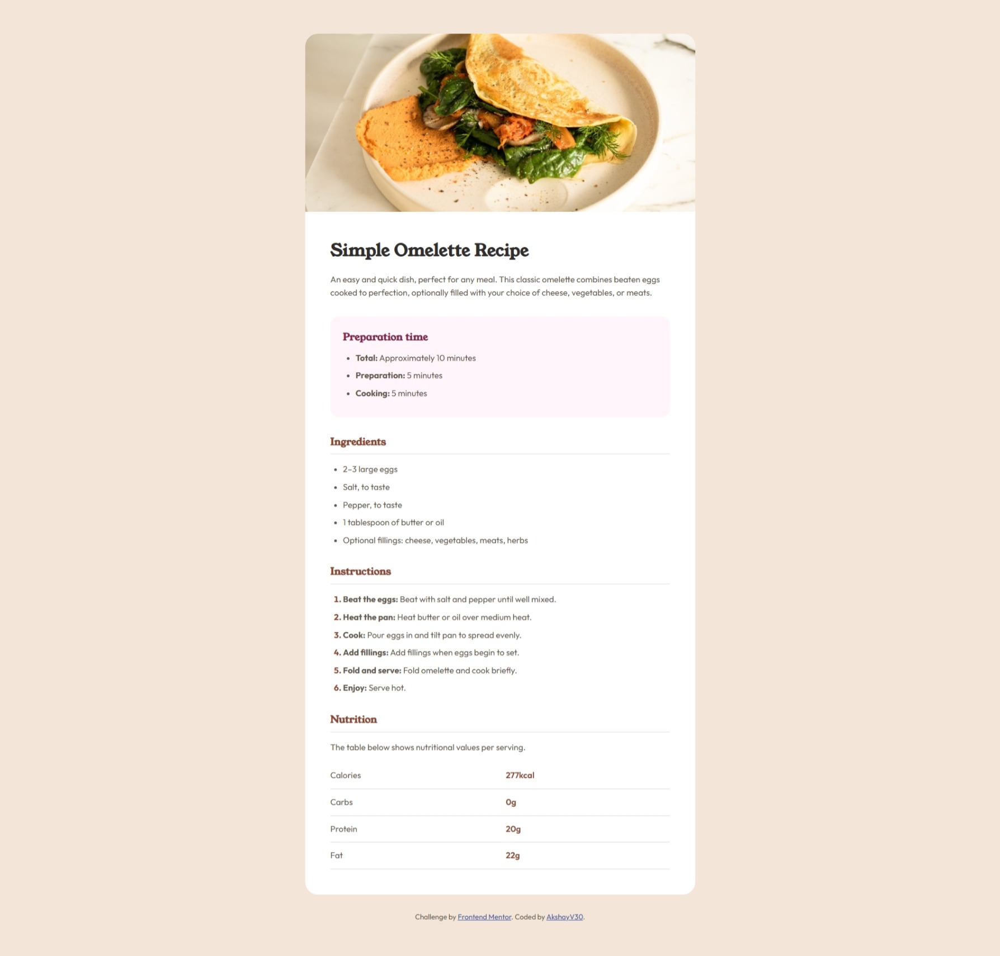
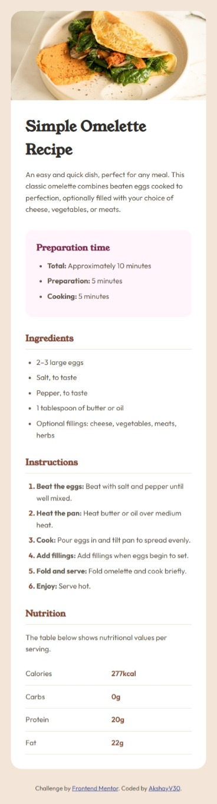

# Frontend Mentor – Recipe Page Solution

This is my solution to the **[Recipe page challenge on Frontend Mentor](https://www.frontendmentor.io/challenges/recipe-page-KiTsR8QQKm)**.
Frontend Mentor challenges help improve front-end skills by building realistic, responsive projects using real-world designs.

---

## Table of contents

- [Frontend Mentor – Recipe Page Solution](#frontend-mentor--recipe-page-solution)
  - [Table of contents](#table-of-contents)
  - [Overview](#overview)
    - [Designs](#designs)
    - [Screenshots](#screenshots)
    - [Links](#links)
  - [My process](#my-process)
    - [Built with](#built-with)
    - [What I learned](#what-i-learned)
    - [Continued development](#continued-development)
    - [Useful resources](#useful-resources)
  - [Author](#author)
  - [Acknowledgments](#acknowledgments)

---

## Overview

### Designs

**Designs Preview**


### Screenshots

**Desktop design**


**Mobile design**


---

### Links

- **Live Site URL:** [Live Demo](https://akshayv30.github.io/Front-End-Mentor-Challenges/src/newbie/recipe-page/index.html)

---

## My process

### Built with

- Semantic HTML5
- CSS custom properties (variables)
- Mobile-first workflow
- Flexbox
- Responsive media queries
- Google Fonts (Young Serif & Outfit)

---

### What I learned

This project helped reinforce the importance of **semantic HTML and clean CSS architecture**.
Key learnings include:

- Structuring content using semantic elements like `header`, `section`, `article`, and `footer`
- Designing **mobile-first** and scaling up with media queries
- Creating reusable CSS using variables
- Making images fully responsive while preserving aspect ratio
- Writing cleaner, more maintainable CSS by reducing over-specific selectors

Example of semantic structure :

```html
<section>
  <h3 class="section-title">Ingredients</h3>
  <ul>
    <li>2–3 large eggs</li>
    <li>Salt, to taste</li>
  </ul>
</section>
```

---

### Continued development

In future projects, I want to focus more on:

- Advanced responsive layouts
- CSS architecture methodologies (BEM / utility-first)
- Accessibility improvements (ARIA roles, contrast, keyboard navigation)
- Performance optimizations for images and fonts

---

### Useful resources

- [MDN Web Docs – HTML Semantics](https://developer.mozilla.org/en-US/docs/Glossary/Semantics)
- [CSS Tricks – A Complete Guide to Flexbox](https://css-tricks.com/snippets/css/a-guide-to-flexbox/)
- [Frontend Mentor Community Solutions](https://www.frontendmentor.io/solutions)

---

## Author

- **Name:** Akshay
- **Frontend Mentor:** [@AkshayV30](https://www.frontendmentor.io/profile/AkshayV30)
- **GitHub:** [AkshayV30](https://github.com/AkshayV30)

---

## Acknowledgments

Thanks to **Frontend Mentor** for providing well-designed challenges that closely resemble real-world projects.
Also appreciate the community solutions that helped inspire cleaner layouts and better responsiveness.

---
